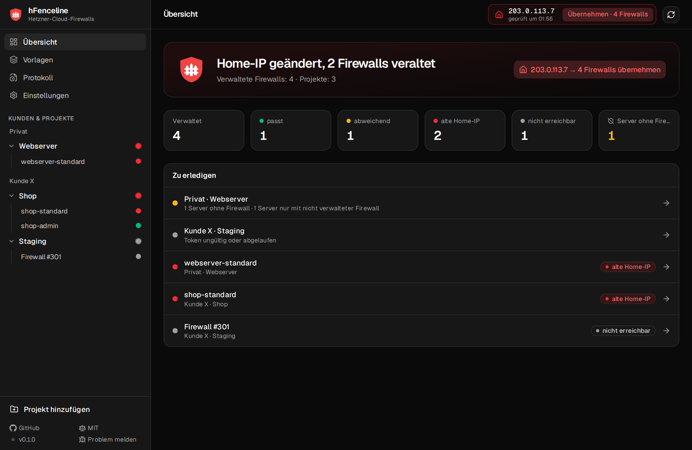
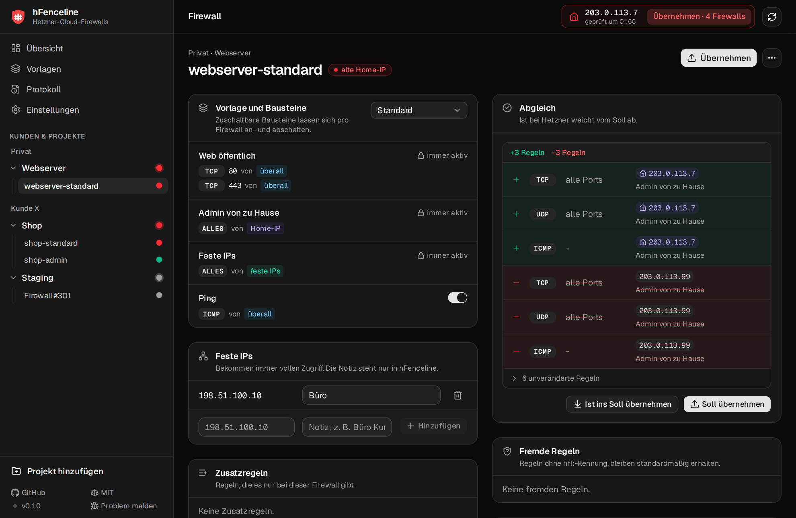
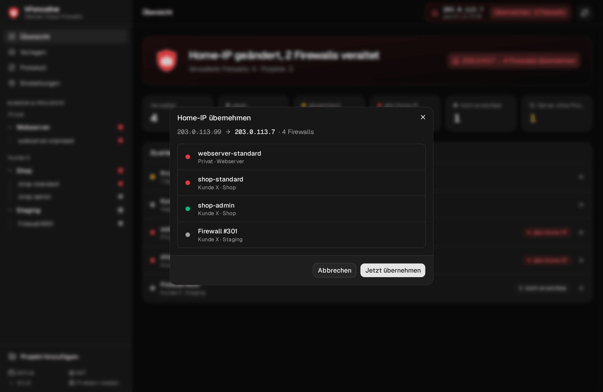
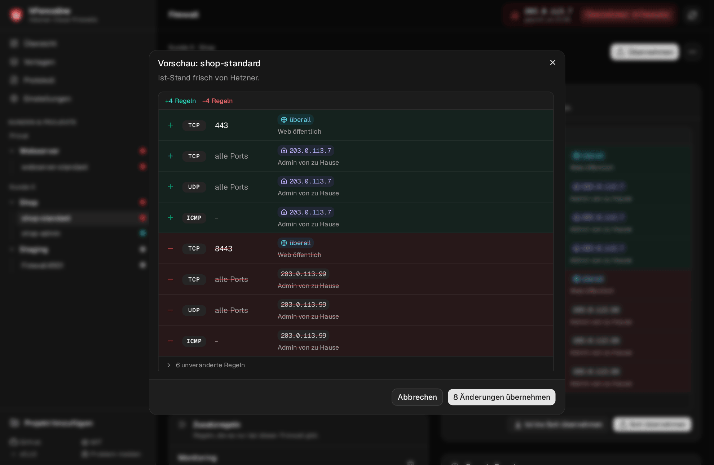
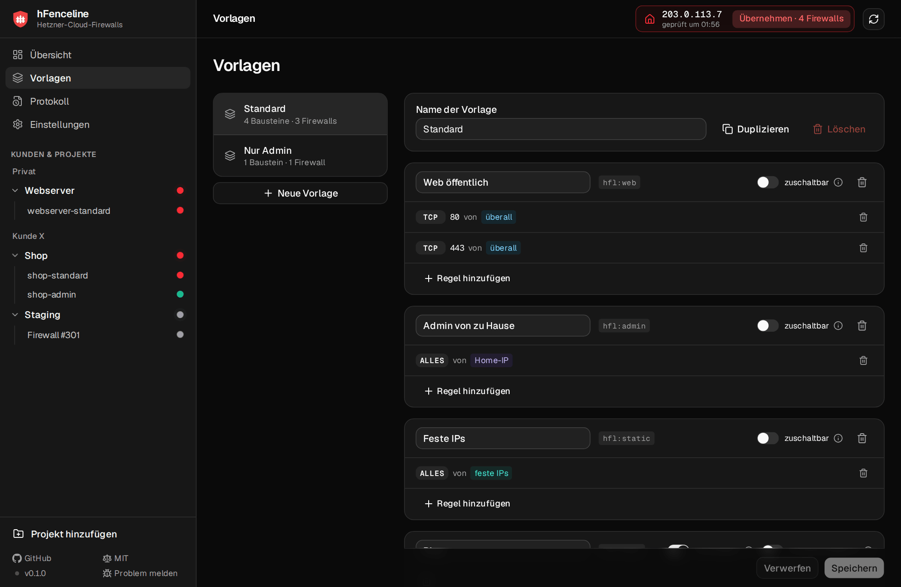
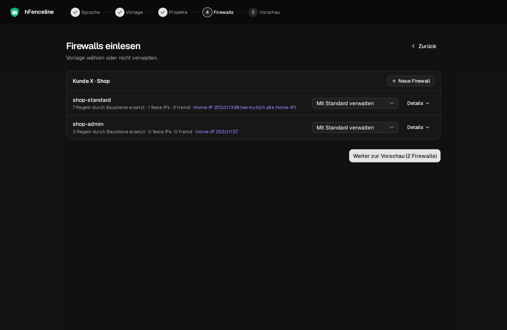

<p align="center">
	
</p>

<h1 align="center">hFenceline</h1>

<p align="center">
	Hetzner-Cloud-Firewalls über alle Kunden, Konten und Projekte einheitlich halten - und die wechselnde Home-IP mit einem Klick überall eintragen.
</p>

<p align="center">
	<a href="https://github.com/srcmkr/hFenceline/releases/latest">Download</a>
	 |
	<a href="#loslegen">Loslegen</a>
	 |
	<a href="#sicherheit-und-datenhoheit">Sicherheit</a>
	 |
	<a href="#lokale-entwicklung">Entwicklung</a>
	 |
	<a href="https://github.com/srcmkr/hFenceline/issues">Issues</a>
</p>

<p align="center">
	<a href="https://github.com/srcmkr/hFenceline/actions/workflows/build.yml"></a>
	<a href="https://github.com/srcmkr/hFenceline/releases/latest"></a>
	
	<a href="LICENSE"></a>
</p>

<p align="center">
	<a href=".github/screenshots/dashboard.png"></a>
</p>

hFenceline ist eine Desktop-App für alle, die viele Hetzner-Cloud-Projekte betreuen. Du beschreibst deine Firewall einmal als Vorlage, hFenceline hält jede verwaltete Firewall danach auf diesem Stand - über eigene Projekte, private Konten und Kundenprojekte hinweg.

Wechselt deine Home-IP über Nacht, zeigt das Tray-Symbol rot. Ein Klick auf **Home-IP übernehmen** trägt die neue Adresse in alle betroffenen Firewalls ein. Kein Einloggen in zehn Konsolen, kein Abtippen von Regeln.

> **Wie es dazu kam:** hFenceline gibt es nur, weil mich das ständige Nachziehen der Firewall-Einstellungen in jedem einzelnen Hetzner-Projekt irgendwann tierisch genervt hat. Es ist ein kleines Sideproject, das mein eigenes Problem löst - wenn es deins auch löst, umso besser.

## Warum hFenceline

- **Home-IP per Klick.** hFenceline prüft die öffentliche IPv4 im Hintergrund und setzt sie auf Wunsch in allen Firewalls, die den Platzhalter `{heim}` nutzen.
- **Vorlagen statt Handarbeit.** Firewalls entstehen aus Bausteinen wie „Web öffentlich“ oder „Admin von zu Hause“. Eine geänderte Vorlage wirkt auf alle Firewalls, die sie nutzen.
- **Ausnahmen pro Firewall.** Feste IPs, zuschaltbare Bausteine wie Ping und eigene Zusatzregeln - ohne die Vorlage zu verbiegen.
- **Erst Vorschau, dann Schreiben.** Vor jeder Änderung holt hFenceline den Ist-Stand frisch von Hetzner und zeigt, welche Regeln hinzukommen und welche entfallen.
- **Handgemachte Regeln bleiben.** Regeln, die nicht von hFenceline stammen, werden als „fremd“ markiert und nie still gelöscht.
- **Warnt, bevor es wehtut.** Hinweise bei drohendem Aussperren, bei mehr als 500 wirksamen Regeln und bei Servern, die ungefiltert im Internet stehen.
- **Ampel im Tray.** Grün: alles passt. Gelb: Abweichung oder ungeschützter Server. Rot: Home-IP geändert oder Fehler.
- **Nachvollziehbar.** Jede Änderung bei Hetzner landet mit Auslöser und Vorher/Nachher im Protokoll.
- **Deutsch und Englisch.** Oberfläche, Tray und Meldungen in beiden Sprachen.

## Einblicke

<p align="center">
	<a href=".github/screenshots/firewall.png"></a>
</p>

<p align="center"><em>Eine Firewall im Detail: Bausteine der Vorlage, feste IPs und der Abgleich mit dem Ist-Stand bei Hetzner.</em></p>

<table align="center">
	<tr>
		<td width="25%" align="center"><a href=".github/screenshots/home-ip.png"></a></td>
		<td width="25%" align="center"><a href=".github/screenshots/vorschau.png"></a></td>
		<td width="25%" align="center"><a href=".github/screenshots/vorlagen.png"></a></td>
		<td width="25%" align="center"><a href=".github/screenshots/assistent.png"></a></td>
	</tr>
	<tr>
		<td align="center"><em>Home-IP per Klick</em></td>
		<td align="center"><em>Vorschau</em></td>
		<td align="center"><em>Vorlagen</em></td>
		<td align="center"><em>Einrichtung</em></td>
	</tr>
</table>

<sub>Alle Screenshots stammen aus dem Demo-Modus mit erfundenen Daten und Adressen aus Dokumentationsbereichen.</sub>

## Die Standardvorlage

| Baustein | Regeln | Standard |
| --- | --- | --- |
| Web öffentlich | TCP 80 und 443 von überall | immer aktiv |
| Admin von zu Hause | voller Zugriff von `{heim}` | immer aktiv |
| Feste IPs | voller Zugriff von den festen IPs der jeweiligen Firewall | immer aktiv, anfangs leer |
| Ping | ICMP von überall | zuschaltbar, standardmäßig aus |

Vorlagen lassen sich duplizieren, umbenennen und um eigene Bausteine erweitern. „Voller Zugriff“ übersetzt hFenceline in die Hetzner-Regeln TCP 1-65535, UDP 1-65535 und ICMP. Es gelten nur eingehende Regeln und nur IPv4.

## Sicherheit und Datenhoheit

hFenceline spricht direkt mit der Hetzner-Cloud-API. Es gibt keinen Server dazwischen und kein Konto, das du irgendwo anlegen musst.

- **Tokens** liegen im Passwortspeicher des Betriebssystems (Linux Secret Service, Windows-Anmeldeinformationsverwaltung). Ohne Secret Service nur nach Zustimmung in `tokens.json` mit Rechten `600`.
- **Konfiguration** liegt lesbar als `config.yaml` unter `~/.config/hfenceline/` bzw. `%APPDATA%\hfenceline\`, das Protokoll daneben als `audit.jsonl`. Beide enthalten keine Tokens.
- **Im Hintergrund wird nur gelesen.** Geschrieben wird bei Hetzner ausschließlich nach deinem Klick.
- **Klare Kennzeichnung.** Eigene Regeln tragen das Präfix `hfl:` in der Beschreibung, verwaltete Firewalls das Label `managed-by=hfenceline`. Alles andere fasst hFenceline nicht ungefragt an.
- **Keine Server-Zuweisung.** Welche Server eine Firewall schützt, entscheidest du weiter in der Hetzner-Konsole. hFenceline warnt nur bei ungeschützten Servern.
- **Weitere Verbindungen:** Die Home-IP ermittelt hFenceline über [ipify](https://www.ipify.org/), nach Updates fragt es die GitHub-API nach dem neuesten Release.

## Loslegen

1. hFenceline für Linux oder Windows aus den [Releases](https://github.com/srcmkr/hFenceline/releases/latest) laden.
2. Im Assistenten Sprache wählen und die Standardvorlage prüfen.
3. Je Hetzner-Projekt ein API-Token mit **Lesen & Schreiben** anlegen (Konsole › Projekt › Sicherheit › API-Tokens) und in hFenceline eintragen.
4. Vorhandene Firewalls einlesen: Regeln, die zur Vorlage passen, werden durch Bausteine ersetzt, der Rest bleibt als feste IP oder fremde Regel erhalten.
5. Fertig. Ab jetzt reicht bei neuer Home-IP ein Klick im Tray.

> **Warum ein Token pro Projekt?** Ein Hetzner-Token gilt immer für genau ein Projekt, Projekte eines Kontos lassen sich per API nicht auflisten. „Kunde“ ist in hFenceline deshalb nur ein Ordner für Projekte.

## Installation

| Plattform | Paket |
| --- | --- |
| Debian, Ubuntu | `.deb` |
| Andere Linux-Distributionen | `.AppImage` |
| Windows | Installer (`.exe`) |

Unter Linux braucht das Tray-Symbol einen Desktop mit AppIndicator-Unterstützung, der Passwortspeicher einen Secret Service wie GNOME Keyring oder KWallet.

### Ohne echte Daten ausprobieren

Der Demo-Modus zeigt die Oberfläche mit einer API-Attrappe. Bei Hetzner wird dabei nichts geändert.

```bash
pnpm install
pnpm demo
```

Gültige Demo-Tokens: `demo-privat-web`, `demo-x-shop`. Mit `?demo=empty` startet der Einrichtungsassistent.

## Lokale Entwicklung

hFenceline ist eine Tauri-2-App. Die gesamte Fachlogik steckt in TypeScript ohne Tauri- und React-Abhängigkeit und ist vollständig getestet; die Rust-Seite bleibt eine dünne Hülle.

Voraussetzungen:

- Node.js 22 oder neuer
- pnpm
- Rust (stable)
- unter Linux zusätzlich:

```bash
sudo apt install libwebkit2gtk-4.1-dev libayatana-appindicator3-dev librsvg2-dev build-essential curl file libssl-dev
```

Häufige Befehle:

| Befehl | Zweck |
| --- | --- |
| `pnpm install` | Abhängigkeiten installieren |
| `pnpm test` | Tests mit Vitest |
| `pnpm typecheck` | TypeScript prüfen |
| `pnpm demo` | Oberfläche im Browser mit erfundenen Daten |
| `pnpm tauri:dev` | Desktop-App im Entwicklungsmodus |
| `pnpm tauri:build` | Pakete bauen: `.deb`, AppImage, Windows-Installer |

## Repository-Karte

| Pfad | Inhalt |
| --- | --- |
| `src/core/plan` | Kern: aus Vorlage, Ausnahmen, Ist-Regeln und Home-IP werden neuer Regelsatz und Unterschiede |
| `src/core/hetzner` | Eigener Client für die Hetzner-Cloud-API mit Seiten, Actions und Rate-Limit |
| `src/core/homeip` | Ermittlung der öffentlichen IPv4 |
| `src/core/model`, `src/core/store` | Konfigurationsmodell, Standardvorlage, Laden und Speichern |
| `src/core/audit` | Änderungsprotokoll |
| `src/core/app` | Service-Fassade für Oberfläche und Tray |
| `src/platform` | Anbindung an Tauri, Browser-Entwicklung und Demo-Modus |
| `src/ui`, `src/tray` | Oberfläche (React, shadcn/ui, Tailwind CSS) und Tray |
| `src/i18n` | Übersetzungen Deutsch und Englisch |
| `src-tauri` | Rust-Hülle: Plugins, Passwortspeicher, Fenster |

## Mitmachen

Fehlerberichte, Ideen und Pull Requests sind willkommen.

- Fehler und Wünsche bitte als [Issue](https://github.com/srcmkr/hFenceline/issues) melden.
- Vor einem Pull Request `pnpm typecheck` und `pnpm test` laufen lassen.
- Neue Texte der Oberfläche immer in `de.json` **und** `en.json` pflegen.

## Lizenz

hFenceline steht unter der [MIT-Lizenz](LICENSE).

hFenceline ist ein unabhängiges Projekt und steht in keiner Verbindung zur Hetzner Online GmbH.
